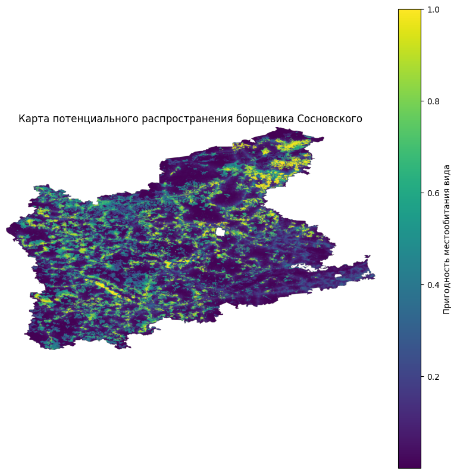

# SDM-modeling_Sosnowsky_hogweed

Моделирование потенциального распространения борщевика Сосновского (*Heracleum sosnowsky*) на территории северо-западных административных округов Московской области с использованием метода максимальной энтропии — **MaxEnt**.

Проект выполнен на Python с использованием библиотеки `elapid` (Anderson, C. B. (2023). elapid: Species distribution modeling tools for Python. Journal of Open Source Software, 8(84), 4930. https://doi.org/10.21105/joss.04930)

## Цель проекта

Цель работы: построить модель пригодности территории (Species Distribution Model, SDM) для распространения борщевика Сосновского на основе точек присутствия вида и набора независимых факторов (природно-климатических, антропогенных предикторов).

## Что делает проект

В ноутбуке `sdm-modeling_maxent_method.ipynb` реализовано SDM-моделирования борщевика Сосновского:

1. загрузка Geotiff-растров из папки `data_predictors`;
2. загрузка CSV-файла с координатами точек присутствия вида;
3. проверка системы координат (CRS), размеров и сетки растров, а также проверка на мультиколлинеарность;
4. генерация фоновых точек;
5. извлечение значений растров в точках;
6. обучение модели MaxEnt;
7. оценка качества модели по AUC-критерию;
8. расчет пермутационной важности предикторов;
9. построение карты пригодности территории;
10. сохранение результатов в формате Geotiff и CSV.

## Исходные данные

Набор предикторов и точки присутствия вида (папка **data_predictors**) можно скачать с облачного хранилища google-диска по ссылке https://drive.google.com/drive/folders/1ZDyJFYlI0t3luce02o3sv16CnrMQ9dCf?usp=sharing. 

Список независимых переменных: 
1. Выведенные из оборота сельскохозяйственные угодья (**abandoned_lands.tif**). Источник: исследование Глушкова и др. (2019) по наборам данных GLAD (Global Land Cover and Land Use Change) по спутниковым снимкам Landsat в целях выявления заброшенных земель (4 класса: пахотные земли, заброшенные в течение 3-6 последних лет и не менее 10 лет назад, залежные земли, заброшенные не менее 20 лет назад и не менее 30 лет назад);
2. среднемесячные осадки июля (**precipitation.tif**). Источник: исторические данные об осадках 1970-2000 гг. по данным глобального набора WorldClim, разрешение 30 секунд (~1 км²), среднемесячные осадки июля;
3. топографический индекс влажности TWI (**twi_index.tif**). Источник: цифровая модель рельефа AW3D, пространственное разрешение 30 метров;
4. почвенный покров (**soil_types.tif**). Источник: Различные типы почв по данным Единого государственного реестра почвенных ресурсов России на основе почвенной карты РФ масштаба 1:2500000;
5. расстояние до заброшенных населенных пунктов (**dist_to_villages.tif**). Источник: проект «ИНИД» («Инфраструктура научно исследовательских данных», «Населенные пункты России: численность населения и географические координаты», численность 0 чел. – 113 объектов), 
2021 год;
6. расстояние до автодорог (**dist_to_road.tif**). Источник: OpenStreetMap (ключ waterway, значение river);
7. расстояние до объектов гидрографии (**dist_to_river.tif**). Источник: OpenStreetMap (ключ highway, значения motorway, primary, secondary, tertiary, trunk).

Точки присутствия вида можно скачать с репозитория: борщевик Сосновского (**points_plants.csv**). Источник: индекс HSI (Heracleum sosnowsky index) за 2025 год, разработанный Д.М. Рыжиковым в 2017 году

## Использованные библиотеки

`elapid`
`rasterio`
`geopandas`
`pandas`
`numpy`
`scikit-learn`
`matplotlib`
`seaborn`

В Google Colab библиотеку `elapid` можно установить командой: `!pip install elapid -q`

## Как запустить
Откройте `sdm-modeling_maxent_method.ipynb` в Google Colab или Jupyter Notebook.
Убедитесь, что папка `data_predictors` содержит .tif-растры и CSV с точками присутствия.
При необходимости измените путь к данным: data_dir = `"/content/drive/MyDrive/data_predictors"`
После выполнения проверьте созданные результаты в папке `data_predictors`.

## Результаты

После выполнения ноутбука создаются следующие файлы: `maxent_model.ela`, `maxent_prediction.tif`, `permutation_importance.csv`

`maxent_model.ela` — сохранённая модель MaxEnt;
`maxent_prediction.tif` — raster-карта предсказанной пригодности территории;
`permutation_importance.csv` — таблица пермутационной важности предикторов.

## Автор

Склюева Наталья
